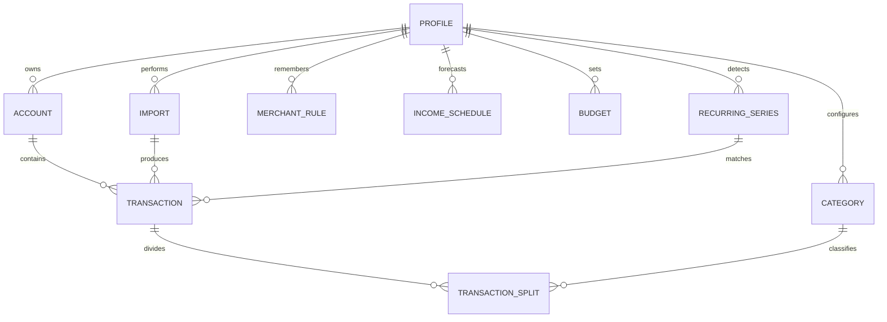

# Spending Tracker App - Product Requirements and Implementation Plan

**Status:** Requirements baseline ready for implementation  
**Working title:** Spending Tracker (final name and branding TBD)  
**Primary user:** Individual user, with isolated profiles for additional people  
**Initial platform:** Local web application on Windows and macOS  
**Base currency:** CAD  
**Document purpose:** Provide Codex and delegated implementation agents with a complete product, architecture, delivery, testing, and coordination plan.

---

## 1. Executive Summary

Build a polished, desktop-first personal spending tracker that imports text-based credit-card statements, converts them into normalized transactions, suggests spending categories, remembers user corrections, detects recurring charges, and presents actionable spending and savings insights.

The first version will run locally in a browser and store all persistent data in SQLite. It will support multiple fully isolated profiles without authentication. TD, American Express, and CIBC credit-card statements are the initial issuer targets. TD and Amex sample statements have been reviewed and are suitable for deterministic text extraction; CIBC parsing remains a discovery task pending samples.

The application must make financial data easy to understand rather than merely storing transactions. Its primary outcomes are:

1. Show where money is being spent.
2. Help the user save more by comparing income, spending, budgets, and expected recurring charges.
3. Surface subscriptions and other repeating charges for review.
4. Make categorization fast through a click-through review queue and remembered merchant rules.
5. Produce trustworthy trends without double-counting statement uploads, credit-card payments, refunds, or transfers.

The safest build sequence is to validate the visual direction with interactive mock data first, establish the data and accounting rules second, implement and test statement parsing third, then connect dashboards and advanced insights to verified real data.

---

## 2. Product Vision and Principles

### 2.1 Vision

Create a local-first financial companion with the clarity of a modern banking app and the flexibility of a personal analytics tool. It should answer, at a glance:

- How much have I spent this month?
- Where did the money go?
- Is my spending rising or falling?
- How much income remains after spending and upcoming recurring charges?
- Which subscriptions or repeating charges should I reconsider?
- Am I staying within my overall and category budgets?
- Which purchases or categories are unusually high?

### 2.2 Product principles

- **Trust before novelty:** Totals must reconcile to source statements before advanced insights are shown.
- **Local first:** Core importing, categorization, analysis, and storage must work without external services.
- **Explainable automation:** Every automatic classification must expose why it happened and remain editable.
- **Fast correction:** Uncertain transactions should be resolved in a quick, keyboard- and click-friendly review flow.
- **No silent data loss:** Payments and excluded transactions remain auditable even when omitted from spending totals.
- **Progressive complexity:** The dashboard starts clear and allows drill-down rather than showing every metric at once.
- **Profile isolation:** Every financial record belongs to exactly one profile.
- **Responsive foundation:** Desktop is the initial target, but components and layouts must not prevent later full mobile support.

---

## 3. Scope

### 3.1 In scope for the first complete release

- Local web app for Windows and macOS.
- Terminal-based startup using one documented command, plus optional convenience scripts.
- SQLite local database.
- Multiple isolated profiles with simple profile switching and no PIN/login.
- Multiple credit-card accounts per profile.
- Custom account/card name and colour.
- Combined all-account views and per-account views.
- Text-based PDF import for TD, Amex, and CIBC.
- Optional CSV/XLSX importer after the canonical import model is stable.
- Duplicate statement and duplicate transaction detection.
- Recognition and exclusion of payments, transfers, refunds/reversals, cash advances, interest, and fees according to the accounting rules below.
- Suggested transaction categories and a rapid review queue.
- Remembered merchant/category rules.
- Manual transactions.
- Transaction editing, splitting, notes, tags, filtering, bulk categorization, soft deletion, and restore.
- Scheduled income entered manually as weekly, biweekly, or monthly.
- Overall monthly budgets and category budgets.
- Recurring-charge detection, confirmation, status, forecasting, and in-app reminders.
- Dashboard, charts, trends, comparisons, and basic unusual-spending insights.
- CSV/XLSX transaction export and PDF summary/report export.
- Light and dark themes.

### 3.2 Explicitly deferred

- Bank API connections or automatic transaction syncing.
- Scanned PDF/OCR support.
- User accounts, passwords, PINs, cloud authentication, and remote multi-user hosting.
- Database or statement encryption.
- SMS/text notifications.
- Native mobile apps.
- Full Progressive Web App installation/offline caching.
- Debt-management workflows.
- Investment or net-worth tracking.
- Automated tax classification.
- Paid AI dependency for core categorization.
- Persisting original PDF statements after successful import.

### 3.3 Future-ready, but not first-release requirements

- Optional AI fallback for uncertain merchant categorization.
- Full phone-browser functionality.
- PWA home-screen installation.
- SMS reminders through an opt-in provider.
- Secure hosted deployment with authentication, encryption, secrets management, backups, and per-user authorization.
- Household combined views across explicitly selected profiles.

---

## 4. Users, Profiles, and Data Boundaries

### 4.1 Profile behavior

- The app opens to the most recently used profile or a profile chooser.
- A user can create, rename, select, and archive a profile.
- Every account, import, transaction, category override, merchant rule, budget, income schedule, recurring charge, tag, and setting is scoped to one profile.
- Switching profiles must immediately clear profile-specific cached queries and update every visible metric.
- No combined household view is required initially.
- No authentication or PIN is required locally.
- Profile deletion should not be implemented until a deliberate confirmation and data-export path exist. Archiving is safer for the first release.

### 4.2 Local privacy boundary

- The server binds to `127.0.0.1` by default, not all network interfaces.
- Uploaded PDFs are processed in a temporary directory and deleted after a committed, verified import or after a failed/cancelled import cleanup.
- Raw PDF bytes and full extracted statement text are not stored permanently.
- The database retains only structured transactions, statement metadata, validation results, source filename, parser version, and non-reversible fingerprints needed for auditing and deduplication.
- Application logs must not contain full account numbers, full raw statement pages, or transaction lists.

---

## 5. Accounts and Cards

Each profile may have multiple card accounts.

Required account fields:

- Profile ID.
- Issuer: TD, American Express, CIBC, or Other.
- User-defined display name.
- Card colour.
- Last four/five visible digits when available; never require a full card number.
- Currency, fixed to CAD initially but stored as an ISO currency code.
- Optional issuer-specific account fingerprint.
- Active/archived state.
- Created and updated timestamps.

Required behavior:

- Dashboard defaults to all active cards combined.
- A global account filter can switch to one card.
- The selected account filter applies consistently to metrics, charts, transactions, recurring charges, and reports.
- Per-account metrics use exactly the same calculation definitions as combined metrics.
- Archiving a card hides it from default filters but preserves history.
- Import should suggest an existing account based on issuer and masked digits, or prompt for an account if confidence is insufficient.

Statement balance, minimum payment, due date, credit limit, and available credit may be extracted as optional metadata for reconciliation, but credit-management features are not a primary first-release workflow.

---

## 6. Statement Import Requirements

### 6.1 Supported inputs

Priority order:

1. Text-based PDF statements.
2. CSV files with a column-mapping preview.
3. XLSX files using the same canonical mapping workflow as CSV.

Scanned/image-only PDFs must be rejected with a clear message explaining that OCR is not currently supported.

### 6.2 Import workflow

1. User selects a profile.
2. User opens **Import Statements** and drops or selects one or more files.
3. App validates file type, file size, and text extractability.
4. App identifies the issuer and parser version.
5. App extracts statement metadata and transaction candidates into a temporary staging model.
6. App selects or asks for the destination card account.
7. App checks exact statement duplicates and potential transaction overlaps.
8. App displays an import preview containing:
   - Issuer and account.
   - Statement period.
   - Transactions detected.
   - Purchases, credits/refunds, payments, fees/interest, and unresolved rows.
   - Expected versus parsed totals where the statement provides summary totals.
   - Duplicates that will be skipped.
   - Parser warnings.
9. User confirms the import.
10. The server commits the import, transactions, raw descriptions, fingerprints, and validation results atomically.
11. The original file and temporary extracted text are deleted.
12. User proceeds to the category-review queue or dashboard.

No partial import may remain if the database transaction fails.

### 6.3 Issuer parser architecture

Create an explicit parser interface rather than a single universal regular expression:

```text
StatementParser
  detect(document) -> confidence
  extract_metadata(document) -> StatementMetadata
  extract_transactions(document) -> ParsedTransaction[]
  reconcile(metadata, transactions) -> ValidationReport
```

Implement separate adapters:

- `TdCreditCardParser`
- `AmexCanadaParser`
- `CibcCreditCardParser`
- `CsvTransactionParser`
- `XlsxTransactionParser`

All parsers output the same canonical staging model. Issuer-specific knowledge must stay inside its adapter.

### 6.4 Findings from supplied TD statements

The reviewed TD samples are text-extractable, copy-permitted PDFs even when marked as encrypted for document modification. They contain:

- Statement date and explicit statement-period range.
- Transaction date, posting date, activity description, and amount columns.
- Transaction rows beginning on the first page and continuing across pages.
- A `PAYMENT - THANK YOU` pattern with negative amounts.
- Summary totals for payments/credits, purchases/other charges, interest, fees, and new balance.
- Multi-line foreign-currency purchases containing original currency/amount and exchange-rate continuation lines.
- Page headers, side summaries, payment slips, rewards details, and legal text interleaved with extracted page content.

TD parser acceptance requirements:

- Ignore page headers, footers, payment slips, rewards balances, and legal pages.
- Preserve both transaction and posting dates.
- Attach foreign-currency continuation lines to the preceding purchase.
- Store the charged CAD amount as the transaction amount.
- Optionally store original foreign amount, original currency, and exchange rate when present.
- Classify `PAYMENT - THANK YOU` as `payment/transfer`, excluded from spending.
- Correctly parse negative values and values containing commas.
- Reconcile parsed payment/credit, purchase, interest, and fee totals against statement summaries within one cent.

### 6.5 Findings from supplied Amex statements

The reviewed Amex Canada samples are text-extractable and contain:

- Opening and closing dates.
- Transaction date, posting date, details, and amount columns.
- Separate `New Payments`, cardholder transaction, and `Other Account Transactions` sections.
- Statement summary totals for payments, other credits, purchases, fees, interest, cash advances, and other charges.
- Cardholder-section headings that may support additional-card users in future statements.
- Transaction tables continuing across multiple pages.

Amex parser acceptance requirements:

- Start transaction collection only inside recognized transaction sections.
- Classify items in `New Payments` as `payment/transfer` and exclude them from spending.
- Parse purchases under cardholder transaction sections.
- Parse other-account entries such as fees separately from ordinary purchases.
- Preserve transaction and posting dates and raw details.
- Avoid treating summary lines as transactions.
- Reconcile each parsed section and the statement totals within one cent.

### 6.6 CIBC parser discovery gate

CIBC must not be declared supported until representative samples are supplied and the following are documented:

- Statement-period fields.
- Table headers and continuation behavior.
- Payment, refund, fee, interest, foreign-currency, and additional-cardholder patterns.
- Summary totals usable for reconciliation.
- At least three fixture statements or all available examples if fewer exist.

Until that gate passes, the UI should label CIBC as “parser pending” rather than silently attempting a generic import.

### 6.7 Duplicate detection

Use two levels of deduplication.

**Statement-level exact duplicate:**

- Compute a cryptographic SHA-256 file hash before processing.
- Also compute a logical statement key from profile, account, issuer, statement start/end dates, and stable statement metadata.
- If either an exact file hash or confident logical statement match exists, block re-import by default and link to the prior import record.

**Transaction-level overlap:**

- Build a canonical fingerprint from profile, account, transaction date, posting date when available, normalized raw description, signed amount in minor units, transaction type, and an occurrence index.
- Use the occurrence index so two legitimate identical purchases on the same date are not collapsed.
- For overlapping statements or CSV imports, show potential duplicates when the fingerprint is not definitive.
- Automatically skip only high-confidence duplicates.
- Record the decision and source import mapping.

### 6.8 Reconciliation and confidence

An import receives one of these statuses:

- `validated`: parsed section totals match source summary totals.
- `validated_with_warnings`: totals match but non-critical fields are missing.
- `needs_review`: totals do not reconcile, ambiguous rows exist, or account detection is uncertain.
- `failed`: no supported parser, no transaction table, unreadable file, or fatal parse error.

The user must see reconciliation results before committing a `needs_review` import. Parser confidence is never a substitute for arithmetic reconciliation.

---

## 7. Canonical Transaction Model and Accounting Rules

### 7.1 Required transaction fields

- ID and profile ID.
- Account/card ID.
- Transaction date.
- Posting date, nullable.
- Original statement description.
- Cleaned merchant name.
- Signed amount in integer cents.
- Currency code, initially CAD.
- Original foreign amount/currency/exchange rate, nullable.
- Direction: debit or credit.
- Type: purchase, refund, payment/transfer, cash advance, fee, interest, income, adjustment, or unknown.
- Spending inclusion state and exclusion reason.
- Category ID, nullable until reviewed.
- Categorization status: suggested, confirmed, rule-applied, manual, or uncategorized.
- Categorization confidence and explanation.
- Recurring-series ID, nullable.
- Notes.
- Source: PDF import, CSV/XLSX import, or manual.
- Import ID and original parsed row reference, nullable for manual items.
- Soft-deletion timestamp and restoration metadata.
- Created and updated timestamps.

Tags use a many-to-many relationship. Splits use child rows whose amounts must sum exactly to the parent transaction amount.

### 7.2 Spending calculation rules

| Type | Included in spending? | Treatment |
| --- | --- | --- |
| Purchase | Yes | Adds to spending in its category. |
| Refund/reversal | No as a new expense | Reduces spending in the linked or assigned original category for reporting. |
| Credit-card payment | No | Preserved as an excluded payment/transfer. |
| Transfer between own accounts | No | Preserved as an excluded transfer. |
| Cash advance | No by default | Preserved and shown in excluded financial activity. User may override. |
| Interest | No by current requirement | Preserved in an Interest category/type and excluded from core spending. |
| Fee | No by current requirement | Preserved in a Fees category/type and excluded from core spending. |
| Income | No | Included only in income/cash-flow calculations. |
| Unknown | No until reviewed | Must not silently distort spending totals. |

The UI must clearly disclose excluded totals and allow users to inspect them. A future setting may allow fees/interest to count as spending, but the initial default follows the stated requirement.

### 7.3 Refund handling

- Attempt to link a refund to an original purchase using account, merchant similarity, amount, and date window.
- When linked, reduce the original category’s net spending in the refund’s reporting period and show the relationship.
- When not linked, suggest a category and require review.
- Refunds must never appear as income.

### 7.4 Split transactions

- A transaction can be split across two or more categories.
- Split amounts are stored in cents and must equal the parent signed amount exactly.
- Editing the parent amount invalidates existing splits until the user resolves the difference.
- Reports aggregate split amounts, not the unsplit parent category.

---

## 8. Categories and Categorization Engine

### 8.1 Default categories

Initial defaults:

- Housing: rent/mortgage, utilities, and maintenance.
- Groceries: supermarket food shopping only.
- Dining & Takeaway: restaurants, cafes, delivery apps.
- Transport: fuel, transit, rideshare, and parking.
- Health: insurance, prescriptions, gym, and medical appointments.
- Personal Care: haircuts, toiletries, and clothing.
- Shopping: general retail purchases that do not belong in Personal Care.
- Entertainment: subscriptions, events, activities, and hobbies.
- Savings: tracked cash movement, excluded from spending.
- Debt Repayment: card/loan payments, excluded from spending.
- Fees & Interest: preserved financial charges, excluded by default.
- Miscellaneous: temporary fallback to be refined as patterns emerge.
- Uncategorized: unresolved items awaiting review.

Category names, colours, icons, order, archived state, and optional subcategories should be customizable. Full subcategory analytics may follow the initial release, but the schema should support a nullable parent category from the beginning.

### 8.2 Local-first classification pipeline

Apply classifiers in deterministic priority order:

1. User-created exact merchant rule.
2. User-created normalized merchant pattern rule.
3. Previously confirmed merchant mapping for this profile.
4. Built-in issuer/merchant aliases and keyword rules.
5. Lightweight local similarity against previously confirmed merchants.
6. Optional external AI fallback, disabled by default and deferred.
7. Uncategorized/quick-review queue.

Each result must store:

- Suggested category.
- Confidence score/band.
- Rule or evidence that produced it.
- Whether confirmation is required.

### 8.3 Merchant normalization

Normalization should produce a cleaned merchant while retaining the untouched statement description. It may:

- Normalize whitespace and case.
- Remove known terminal/store IDs when safe.
- Standardize common payment-processor prefixes.
- Separate merchant and location.
- Apply user-confirmed aliases.

Normalization must be conservative. Never overwrite the original description.

### 8.4 Quick-review experience

The **Review Categories** screen must support rapid resolution:

- Show merchant, amount, date, card, original description, suggestion, confidence, and reason.
- Present large category buttons with colours/icons.
- One click or keyboard shortcut confirms the suggestion.
- One click selects a different category.
- A “remember for future transactions” control defaults on when merchant identity is reliable.
- Offer “apply to all matching unresolved transactions.”
- Allow skipping and returning later.
- Display review progress and remaining count.
- Provide undo for the most recent action.
- Separate uncertain transaction-type review from ordinary category review.

---

## 9. Transaction Management

The **Transactions** section must provide:

- Combined or per-account view.
- Search across cleaned merchant, original description, notes, and tags.
- Filters for date range, account, category, amount range, type, included/excluded state, recurring state, import, and review state.
- Sorting by date, posting date, merchant, amount, category, and account.
- Pagination or virtualized loading suitable for future multi-year datasets.
- Editing of date, posting date, merchant, description, amount, category, notes, and tags.
- Manual transaction creation.
- Transaction splitting.
- Bulk category assignment.
- Bulk tag or exclude actions where safe.
- Soft deletion and a trash/restore view.
- Source/import provenance.
- Visible explanation for excluded items.
- Audit metadata showing whether a value came from parsing, a rule, or manual editing.

Bulk edits should display the number of affected transactions and require confirmation when they change reporting totals.

---

## 10. Income

Income is manually configured and is not inferred from credit-card statements.

Required income schedule fields:

- Profile.
- Name/source.
- Net amount in cents.
- Frequency: weekly, biweekly, or monthly.
- Start date.
- Optional end date.
- Next expected date.
- Active/paused state.
- Optional notes.

Required behavior:

- Generate forecast occurrences for dashboard calculations without permanently creating infinite future records.
- Allow recording an actual income receipt that differs from the scheduled amount/date.
- Avoid double-counting forecast and actual income.
- Show expected versus recorded income for a selected month.
- Treat income as positive cash flow, never as negative spending.

Gross income and tax/deduction tracking are not required initially.

---

## 11. Budgets and Savings Calculation

### 11.1 Budgets

Support:

- One overall monthly spending budget per profile.
- Optional monthly budget for each spending category.
- Budget progress in amount and percentage.
- Default warning thresholds at 75%, 90%, and 100%, configurable later.
- Month selector and account filter.
- Budget history; editing a future/current budget must not rewrite historical targets unless explicitly requested.

Rollover budgets are deferred unless added after first-release validation.

### 11.2 Available-to-save metric

For the selected month:

```text
Available to save
= recorded income in the period
  + expected income still due in the period
  - included net spending to date
  - confirmed recurring charges expected before period end and not already posted
```

Rules:

- Do not subtract a forecast recurring charge if its matched transaction has already posted.
- Exclude credit-card payments and transfers to avoid double-counting purchases.
- Refunds reduce net spending according to their category treatment.
- Clearly label the result as an estimate when it includes forecast income or charges.
- Provide a tooltip or detail drawer explaining the calculation components.

Named savings goals are deferred but the data model should not prevent them.

---

## 12. Recurring Charges and Subscriptions

### 12.1 Detection

Run recurring detection after import and when transaction history changes.

Candidate grouping should consider:

- Normalized merchant/account.
- Similar amounts within absolute and percentage tolerances.
- Intervals near weekly, biweekly, monthly, quarterly, and annual cadences.
- At least two occurrences for a low-confidence candidate and preferably three for confident automatic detection.
- Amount variance patterns for utilities versus fixed subscriptions.

Avoid labelling ordinary frequent merchants such as groceries or restaurants as subscriptions solely because they recur.

### 12.2 Confidence behavior

- High confidence: automatically create a likely recurring series but mark it reviewable.
- Medium/low confidence: ask the user to confirm.
- Exact amounts are not required; interval consistency and merchant identity matter.
- Every series shows supporting historical transactions.

### 12.3 Recurring-series fields

- Profile and optional account.
- Display name and normalized merchant.
- Expected amount or amount range.
- Cadence.
- Next expected date.
- Confidence and detection rationale.
- Status: keep, review, cancel, ended, or ignored.
- Confirmed-by-user flag.
- Reminder lead time.
- Last matched transaction.
- Price-change history.

### 12.4 Required experience

- Upcoming recurring charges card on the dashboard.
- Dedicated recurring-charge list with monthly and annualized cost.
- Confirm/deny workflow.
- Keep, Review, or Cancel status.
- In-app reminders before expected charges.
- Detection of a missing expected charge and a posted charge.
- No duplicate forecast deduction once a charge posts.
- Future phase: price-increase alerts and text notifications.

The app cannot cancel a subscription; “Cancel” is a user tracking state and should be worded accordingly.

---

## 13. Dashboard and Analytics

### 13.1 Global controls

All dashboard metrics share:

- Active profile.
- Date/month selector.
- All-accounts or single-account filter.
- Consistent treatment of included/excluded transactions.

### 13.2 Dashboard content

Required priority order:

1. Total spending this month.
2. Spending compared with last month.
3. Monthly income versus spending.
4. Estimated amount available to save.
5. Overall budget progress.
6. Spending by category.
7. Upcoming recurring charges.
8. Recent transactions.
9. Largest purchases.
10. Unusual spending or sudden increases.
11. Account/card breakdown.

Use progressive disclosure. The first viewport should show the key figures and primary chart, with detail lower on the page or in drill-down drawers.

### 13.3 Required trend views

- Monthly spending over time.
- Category trends over time.
- Current month versus previous month.
- Current month versus typical monthly average.
- Merchant-level trends.

Suggested charts:

- Category donut or bar chart, with an accessible table alternative.
- Monthly spending line/column chart.
- Income versus spending grouped bars.
- Budget progress bars.
- Merchant/category change table for explanations.

Charts must use category colours consistently, support dark mode, have readable tooltips, and never rely on colour alone.

### 13.4 Metric definitions

- **Total spending:** Sum of included purchases plus category-adjusted refunds in the selected period.
- **Previous-month comparison:** Current period-to-date versus the equivalent elapsed portion of the prior month when the current month is incomplete; full-month versus full-month for completed months.
- **Typical monthly average:** Mean of available complete months, excluding the current incomplete month; show the number of months used.
- **Largest purchases:** Highest included purchase amounts, excluding payments/transfers and optionally excluding refunded purchases.
- **Account breakdown:** Included spending grouped by account.
- **Category trend:** Net included spending allocated through splits/refunds.

### 13.5 Unusual-spending insight

Initial implementation should be explainable and rule-based:

- Compare current category spending against prior complete-month average when at least two prior months exist.
- Highlight large percentage changes only when the absolute difference exceeds a minimum meaningful threshold.
- Flag unusually large individual purchases relative to that merchant or category history.
- State the comparison plainly, including the period and baseline.
- Do not call a result anomalous when insufficient history exists.

Advanced statistical anomaly detection is deferred until more history is available.

---

## 14. Reports and Exports

### 14.1 Transaction export

Export filtered or full transactions to CSV and XLSX with:

- Dates.
- Raw description and cleaned merchant.
- Signed amount and currency.
- Account.
- Type.
- Included/excluded state.
- Category and split details.
- Notes and tags.
- Recurring status.
- Source import metadata.

### 14.2 PDF report

Generate a polished summary for a selected profile, date range, and account filter containing:

- Total spending.
- Income and estimated available-to-save.
- Category breakdown.
- Monthly trend.
- Largest purchases.
- Recurring-charge summary.
- Budget performance.
- Applied filters and generation date.

Exports must be generated from the same reporting queries as the UI to avoid inconsistent totals.

---

## 15. Navigation and UI Requirements

Top-level sections:

1. Dashboard
2. Transactions
3. Import Statements
4. Review Categories
5. Recurring Charges
6. Budgets
7. Income
8. Reports/Trends
9. Accounts
10. Profiles
11. Settings

### 15.1 Visual direction

- Modern banking-app aesthetic.
- Prominent, legible charts.
- Consistent category colours.
- Light and dark modes with system preference detection and manual override.
- Clear cards, restrained shadows, generous spacing, and strong number typography.
- Desktop-first responsive layout.
- Avoid dense admin-dashboard styling.

### 15.2 UI prototype gate

Before backend feature implementation, build three small interactive UI directions using mock data. Each must include the same dashboard, transaction list, and category-review sample so they can be compared fairly.

Prototype variables:

- Colour palette and category-colour treatment.
- Navigation style.
- Metric-card density.
- Chart emphasis.
- Light/dark appearance.
- Working-name/logo treatment.

Select and document one direction before building production components. Do not create three independent production component systems.

### 15.3 Accessibility

- Keyboard-accessible navigation and category review.
- Visible focus states.
- Semantic table markup.
- WCAG AA contrast targets.
- Text/icon indicators in addition to category colours.
- Accessible names and descriptions for charts, with tabular alternatives.
- Reduced-motion support for nonessential animation.

### 15.4 Responsive foundation

- Use responsive grids and reusable breakpoints from the first phase.
- Do not hard-code desktop-only widths into data tables or charts.
- Initial acceptance targets common laptop/desktop widths.
- Tablet and phone layouts may be visually reasonable but are not required to expose full polished functionality until a later phase.

---

## 16. Recommended Technical Architecture

### 16.1 Stack

**Frontend**

- React with TypeScript and Vite.
- A mature accessible component foundation such as shadcn/ui primitives with Tailwind CSS.
- TanStack Query for server state.
- TanStack Table for transactions.
- React Hook Form plus schema validation.
- Recharts or an equivalent accessible React chart library.

**Backend**

- Python 3.12 or 3.13.
- FastAPI.
- Pydantic request/response models.
- SQLAlchemy 2 and Alembic migrations.
- `pdfplumber`/Poppler-backed text extraction with issuer-specific parsing.
- Pandas/openpyxl only for CSV/XLSX import/export where they simplify reliable handling.

**Storage**

- SQLite with foreign keys enabled and WAL mode.
- Store money as integer cents, never binary floating-point.
- Store timestamps in UTC and local financial dates as ISO dates.

**Testing**

- Pytest for parsers, services, reporting calculations, and API tests.
- Vitest and React Testing Library for UI logic.
- Playwright for critical end-to-end workflows.

### 16.2 Why this architecture

- Python has dependable PDF and tabular-data tooling for bank statements.
- React/TypeScript supports the desired polished banking-style UI and future responsive web experience.
- FastAPI keeps the local API explicit and testable.
- SQLite is more than sufficient for the expected initial volume and simplifies local setup.
- A clean HTTP boundary allows future hosting without rewriting the frontend.

### 16.3 Repository shape

```text
spending-tracker/
  apps/
    web/                 React application
    api/                 FastAPI application
  packages/
    ui/                  Shared design-system components/tokens
    contracts/           Generated or shared API types/schema
  fixtures/
    statements/          Redacted/synthetic parser fixtures
  docs/
    architecture/
    decisions/
    parser-notes/
  scripts/
    start-local.ps1
    start-local.sh
  tests/
    e2e/
  README.md
```

The exact monorepo tooling may be simplified if it creates avoidable setup friction, but frontend, backend, fixtures, and documentation boundaries must remain clear.

### 16.4 Local startup

Initial supported path:

- One bootstrap/setup command documented for Windows and macOS.
- One start command that launches the API and frontend and opens the local browser.
- Provide PowerShell and shell convenience scripts after the basic commands are reliable.
- Avoid requiring Docker for ordinary use.
- Docker may be added for contributors or hosted deployment later.

The release README must include prerequisites, setup, startup, update, database location, and troubleshooting instructions.

---

## 17. Data Model

Core entities:



Additional entities/tables:

- `merchant_alias`
- `tag`
- `transaction_tag`
- `import_warning`
- `import_transaction_link`
- `income_occurrence`
- `notification`
- `app_setting`
- `audit_event` for important user edits

### 17.1 Important constraints

- Every profile-scoped table has a non-null profile ID.
- Service-layer queries require profile ID; never rely only on frontend filtering.
- Account must belong to the same profile as its transactions/imports.
- Split sum must equal parent transaction amount.
- Only one active overall budget per profile/month.
- Only one active category budget per profile/category/month.
- File hash and logical statement keys are indexed.
- Transaction canonical fingerprints are indexed by profile/account.
- Soft-deleted transactions are excluded from metrics by default.

### 17.2 Migration discipline

- All schema changes use Alembic migrations.
- Seed default categories through an idempotent service, not hard-coded database IDs.
- Include migration tests from a blank database and from the previous release schema.

---

## 18. API Surface

Suggested resource groups:

- `/profiles`
- `/accounts`
- `/imports` and `/imports/{id}/preview|commit`
- `/transactions` and `/transactions/bulk`
- `/categories`
- `/merchant-rules`
- `/review-queue`
- `/income-schedules`
- `/budgets`
- `/recurring-series`
- `/analytics/dashboard`
- `/analytics/trends`
- `/reports/export`
- `/settings`

API requirements:

- Profile ID is explicit in scoped requests.
- Validation errors are field-specific and user-readable.
- Import preview is separate from commit.
- Mutating endpoints return the recalculation impact or invalidated query scopes.
- Analytics endpoints return metric values plus definition/context needed for tooltips.
- OpenAPI schema is generated and used to maintain frontend types.

---

## 19. Non-Functional Requirements

### 19.1 Correctness

- Monetary arithmetic uses integer cents or decimal values at parsing boundaries.
- Imported statement totals reconcile within CAD $0.01 when summary totals are available.
- Dashboard, transaction filters, exports, and reports use shared service calculations.
- Duplicate prevention is deterministic and tested.

### 19.2 Performance

For a profile with 10,000 transactions on a typical laptop:

- Dashboard API target: under 500 ms after warm startup.
- Filtered transaction page target: under 300 ms.
- UI interaction target: visible feedback within 100 ms.
- Typical statement preview target: under 5 seconds.

These are engineering targets, not reasons to prematurely optimize.

### 19.3 Reliability

- Import commits are atomic.
- Temporary files are cleaned after success, failure, or cancellation.
- Database foreign keys are enabled.
- Errors do not expose private statement contents.
- Parser version is recorded so imports can be reproduced/debugged.

### 19.4 Observability

- Structured local logs with severity and request/import IDs.
- Parser logs report section counts, reconciliation deltas, and warnings without transaction descriptions unless debug mode is deliberately enabled.
- UI shows actionable errors and a copyable non-sensitive diagnostic summary.

### 19.5 Browser support

- Current Chrome, Edge, Firefox, and Safari on desktop.
- Local development tested specifically on Windows Edge/Chrome and macOS Safari/Chrome.

---

## 20. Delivery Stages and Acceptance Gates

### Stage 0 - Repository and decision setup

Deliverables:

- Repository scaffold, formatting, linting, test runners, environment example, and architecture-decision records.
- Confirm working title remains temporary.
- Establish fixture privacy rules.
- Add CI for lint, unit tests, and builds.

Gate:

- A new developer can install dependencies and run placeholder frontend/backend tests on Windows or macOS from the README.

### Stage 1 - UI explorations and design selection

Deliverables:

- Three interactive visual directions using synthetic data.
- Dashboard, transaction table, and category-review flow in each direction.
- Light/dark variants and responsive foundations.
- Documented chosen design tokens, chart conventions, and navigation.

Gate:

- User selects one direction before production page development.
- Selected direction meets basic contrast and keyboard checks.

### Stage 2 - Core domain, database, and profiles

Deliverables:

- FastAPI/SQLite foundation and migrations.
- Profile, account, category, transaction, split, tag, import, income, budget, recurring-series, and rule schemas.
- Profile switching and account management UI.
- Seed categories and money/date utilities.

Gate:

- Profile isolation tests pass.
- Money calculations and split constraints pass.
- App starts locally with one command after setup.

### Stage 3 - Import framework and TD parser

Deliverables:

- Temporary upload/staging/preview/commit pipeline.
- Parser interface, document extractor, safe cleanup, fingerprints, and reconciliation report.
- TD parser including continuations, payments, negative amounts, and foreign-currency details.
- Redacted or synthetic regression fixtures based on all supplied TD layout variants.

Gate:

- Every supplied TD statement reconciles to statement section totals within one cent.
- Re-upload is blocked/skipped without duplicate transactions.
- PDF bytes and extracted full text are absent after commit.

### Stage 4 - Amex parser and multi-import reliability

Deliverables:

- Amex section-aware parser.
- Multi-file import UI.
- Cross-import duplicate logic and warnings.
- Parser fixture matrix and reconciliation tests.

Gate:

- Every supplied Amex statement reconciles within one cent.
- Payments and fees are correctly typed and excluded according to requirements.
- Mixed TD/Amex batch import routes each file correctly.

### Stage 5 - CIBC discovery and parser

Deliverables:

- CIBC layout notes based on supplied samples.
- CIBC parser and regression fixtures.
- Clear unsupported-format errors.

Gate:

- Representative CIBC samples reconcile within one cent.
- No CIBC support claim before the discovery checklist is complete.

### Stage 6 - Categorization and transaction workspace

Deliverables:

- Merchant normalization.
- Default rules, remembered profile rules, confidence/explanations.
- Quick-review queue.
- Full transaction table, filters, edits, splits, tags, bulk recategorization, soft delete, and restore.

Gate:

- A user can import a statement, resolve all uncertain transactions quickly, re-import a later statement, and see remembered merchant rules applied.
- Undo and bulk actions are tested.

### Stage 7 - Income, budgets, and recurring charges

Deliverables:

- Weekly, biweekly, and monthly income schedules.
- Overall and category budgets.
- Rule-based recurring detection and confirmation.
- Upcoming-charge forecasts and in-app reminders.
- Available-to-save calculation.

Gate:

- Forecast/posted recurring charges cannot be double-counted.
- Income forecast and actual records cannot be double-counted.
- Budget and savings calculations pass scenario-based tests.

### Stage 8 - Dashboard and trends

Deliverables:

- All required dashboard metrics and filters.
- Monthly, category, comparison, average, merchant, and account analytics.
- Explainable unusual-spending insights.
- Accessible charts and drill-downs.

Gate:

- Every dashboard total can be reproduced from filtered transactions.
- Current-versus-prior comparisons handle partial months correctly.
- Account filters affect all cards consistently.

### Stage 9 - Reports, exports, and polish

Deliverables:

- CSV/XLSX transaction export.
- PDF summary report.
- Empty/loading/error states.
- Accessibility and cross-browser pass.
- Windows/macOS convenience launch scripts.

Gate:

- Exported totals match the UI under identical filters.
- PDF report renders without clipping or unreadable charts.
- Clean installation/startup is verified on both target operating systems.

### Stage 10 - Release hardening

Deliverables:

- Full end-to-end regression suite.
- Fixture coverage report.
- Database migration rehearsal.
- User guide and troubleshooting guide.
- Known-limitations document.

Gate:

- All release acceptance scenarios pass.
- No unresolved high-severity data-integrity or privacy defects.

---

## 21. Agent Delegation Plan

The implementation should use a lead/orchestrator plus bounded specialist agents. Parallel work begins only after interfaces and file ownership are agreed.

### 21.1 Roles

#### Agent A - Lead architect and integrator

Owns:

- Requirements traceability.
- Architecture decisions and shared contracts.
- Repository structure.
- Database/domain boundaries.
- Cross-agent integration and final review.
- Milestone acceptance and release notes.

Must not delegate final responsibility for accounting definitions, profile isolation, or parser reconciliation.

#### Agent B - UX and frontend

Owns:

- UI explorations and selected design system.
- React pages/components.
- Light/dark themes.
- Tables, filters, forms, charts, accessibility, and responsive behavior.
- Frontend unit/component tests.

File boundary:

- `apps/web/**`
- `packages/ui/**`
- Frontend portions of `tests/e2e/**` in coordination with Agent A.

#### Agent C - Import and parsing

Owns:

- PDF/text extraction.
- Parser interface and TD/Amex/CIBC adapters.
- Canonical parsed staging model.
- Reconciliation, fingerprints, duplicate candidates, and parser fixtures.
- Parser unit/regression tests.

File boundary:

- `apps/api/importing/**`
- `apps/api/parsers/**`
- `fixtures/statements/**`
- Parser test directories.

#### Agent D - Backend domain and analytics

Owns:

- SQLAlchemy models/migrations and API services.
- Categorization rules and merchant normalization.
- Transaction editing/splitting.
- Income, budgets, recurring detection, dashboard queries, and exports.
- Backend service/API tests.

File boundary:

- `apps/api/models/**`
- `apps/api/services/**`
- `apps/api/routes/**`
- `apps/api/analytics/**`
- Alembic migrations, with Lead approval.

### 21.2 Coordination rules

- Agent A publishes canonical Pydantic/OpenAPI contracts before frontend/backend parallel implementation.
- Only Agent A or one explicitly assigned migration owner edits a migration revision at a time.
- Agent C does not write directly to final transaction tables; it outputs the agreed staging model.
- Agent D owns the staging-to-domain commit service.
- Agent B consumes generated API types and does not recreate financial formulas in the frontend.
- Shared money, date, transaction-type, and category semantics require an architecture-decision update.
- Each agent provides tests and a concise handoff note with changed files, assumptions, and open risks.
- Agents must not modify files outside their assigned boundary without first notifying Agent A.
- Integrate in small milestone branches; do not allow several stages of unmerged divergence.

### 21.3 Suggested parallelization by stage

| Stage | Agent A | Agent B | Agent C | Agent D |
| --- | --- | --- | --- | --- |
| 0 | Architecture/repo | Frontend tooling | Parser fixture policy | Backend tooling/schema proposal |
| 1 | Review/decision log | Three UI prototypes | Inspect sample formats | Mock API/data contracts |
| 2 | Integrate/contracts | Profiles/accounts UI | Parser interface design | Models/migrations/services |
| 3-5 | Acceptance/integration | Import preview UI | Issuer parsers | Import commit/dedup services |
| 6 | Integration | Review + transactions UI | Normalization support | Categorization/transaction services |
| 7 | Calculation review | Income/budget/recurring UI | Import regression | Forecast/detection services |
| 8 | Metric audit | Dashboard/charts | Regression support | Analytics queries/insights |
| 9-10 | Release validation | Polish/a11y/e2e | Parser hardening | Exports/performance/migrations |

### 21.4 Required agent handoff template

Each delegated task should return:

```text
Task:
Files changed:
Contract/interface used:
Acceptance tests run:
Results:
Assumptions:
Known limitations or follow-ups:
```

---

## 22. Testing Strategy

### 22.1 Parser fixture policy

- Never commit unredacted personal statements to a public repository.
- Prefer synthetic fixtures that reproduce layout and edge cases.
- If redacted PDFs are used privately, remove names, addresses, account digits beyond safe masked identifiers, barcodes, and unrelated personal data.
- Maintain expected canonical JSON outputs for each fixture.
- Record issuer, layout version, page count, statement period shape, and covered edge cases.

### 22.2 Parser tests

For each issuer:

- Issuer detection confidence.
- Metadata extraction.
- First/middle/last page transaction collection.
- Page-break continuation.
- Multi-line descriptions.
- Payment recognition.
- Negative amount/refund recognition.
- Fee and interest sections.
- Foreign currency.
- Multiple identical legitimate transactions.
- Summary/footer lines not parsed as transactions.
- Reconciliation within one cent.
- Unsupported layout failure with actionable error.

### 22.3 Domain calculation tests

- Spending includes purchases only under the defined policy.
- Payments/transfers never inflate spending or income.
- Linked refunds reduce the correct category.
- Splits sum and aggregate correctly.
- Soft-deleted/excluded transactions are omitted.
- Profile/account/date filters compose correctly.
- Partial-month comparisons use matching elapsed days.
- Typical average excludes incomplete months.
- Available-to-save prevents income and recurring forecast double-counting.
- Budget thresholds and history behave correctly.

### 22.4 End-to-end scenarios

1. Create profile and two cards.
2. Import one TD statement, preview warnings, reconcile, and commit.
3. Re-import the same statement and verify zero duplicates.
4. Import an Amex statement and verify combined/per-account dashboard totals.
5. Categorize uncertain merchants and apply remembered rules to a later import.
6. Split a purchase, add tags, bulk recategorize, delete, and restore.
7. Add biweekly income and overall/category budgets.
8. Confirm a recurring charge and verify forecast behavior when the next charge posts.
9. Export a filtered XLSX and PDF report and reconcile totals.
10. Switch profiles and verify no data leakage.

### 22.5 Visual and accessibility QA

- Screenshot tests for key pages in light/dark themes.
- Keyboard-only category-review workflow.
- Chart and table alternatives.
- Desktop widths on Windows and macOS browsers.
- Basic narrow-width smoke test to protect later mobile work.

---

## 23. Risks and Mitigations

| Risk | Impact | Mitigation |
| --- | --- | --- |
| Issuer changes PDF layout | Imports fail or misparse | Versioned issuer adapters, detection confidence, reconciliation, regression fixtures. |
| PDF text order differs from visual order | Wrong rows/totals | Layout-aware extraction, page/section state machines, arithmetic reconciliation. |
| Legitimate identical purchases mistaken for duplicates | Data loss | Occurrence-aware fingerprints; auto-skip only high-confidence duplicates. |
| Payments counted as spending | Incorrect trends | Preserve explicit transaction types and centralized inclusion policy. |
| Refunds treated as income | Inflated savings | Dedicated refund type and original-category linking. |
| Recurring forecasts double-count posted charges | Incorrect available-to-save | Match forecast occurrence to posted transaction before calculation. |
| Merchant rules overgeneralize | Repeated bad categories | Conservative normalization, explainable rules, undo/edit rule management. |
| UI prototypes become throwaway production forks | Schedule waste | Compare with identical mock data, choose once, consolidate tokens/components. |
| Local app setup is difficult across OSes | User cannot run it | Supported runtime versions, bootstrap/start scripts, clean-machine tests. |
| Hosting later exposes local assumptions | Security risk | Bind localhost now; require separate authentication/security phase before hosting. |
| Insufficient history for anomaly detection | Misleading insights | Minimum-history gates and explicit baselines. |

---

## 24. Definition of Done for First Complete Release

The release is complete only when:

- The selected UI direction is implemented consistently in light and dark modes.
- Windows and macOS setup/start instructions have been verified.
- Profiles and accounts are isolated correctly.
- Supplied TD and Amex samples import and reconcile within one cent.
- CIBC is either validated against supplied samples or clearly marked unsupported/pending.
- Duplicate statement imports do not duplicate transactions.
- Payments, transfers, refunds, fees, interest, and purchases follow the documented rules.
- Categorization suggestions, quick review, and remembered rules work end to end.
- All specified transaction editing and recovery features work.
- Weekly, biweekly, and monthly income schedules work.
- Overall and category budgets work.
- Recurring charges can be detected, confirmed, forecast, and tracked.
- Dashboard and trend metrics match underlying filtered transactions.
- CSV/XLSX and PDF exports match UI totals.
- Original PDFs and raw extracted text are deleted after import.
- Critical unit, parser, API, and end-to-end tests pass.
- No high-severity correctness, privacy, or data-loss defects remain.

---

## 25. Open Decisions and Required Inputs

These do not block Stages 0-4 unless noted:

1. Final app name and branding, to be explored in Stage 1.
2. Selection of one of the three UI directions, required before production UI work.
3. CIBC sample statements, required before claiming CIBC support.
4. Whether fees and interest should remain excluded permanently or become a user preference after first release.
5. Whether category-budget rollover is desirable after initial budget use.
6. Whether named savings goals should be promoted into a future milestone.
7. Hosting/security requirements if remote access becomes a real goal.

---

## 26. Recommended First Codex Prompt

Use this document as the source of truth. Begin only with Stages 0 and 1. Do not implement statement parsing or production dashboard services yet.

Suggested prompt:

> Read `SPENDING_TRACKER_PRODUCT_PLAN.md` fully. Create a concrete execution plan for Stages 0 and 1, then scaffold the repository and build three comparable interactive UI directions using the same synthetic financial dataset. Follow the agent delegation and file-ownership rules in the plan. Do not use real statement data in UI fixtures, do not begin production PDF parsing, and do not select a visual direction on my behalf. Verify the setup and UI builds, then present the three options for review.

After a UI direction is selected, continue stage by stage and treat every acceptance gate as a stop/checkpoint rather than attempting the entire application in one pass.

