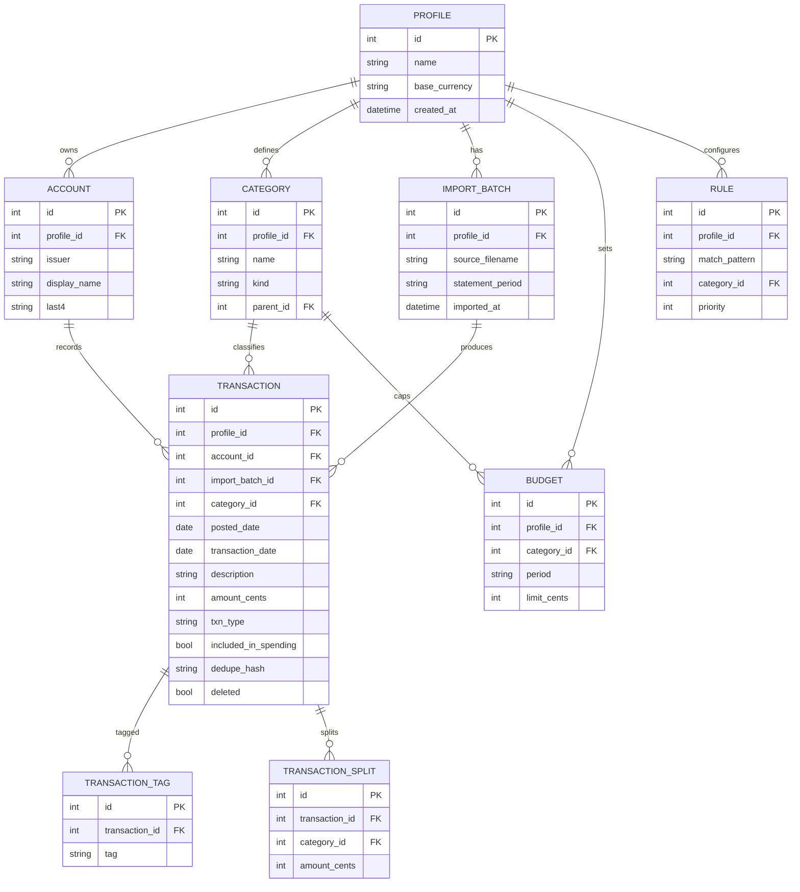

# Architecture Overview

A polished, desktop-first, **local-first** personal spending tracker. It imports
text-based credit-card statements, normalizes them into transactions, suggests
categories, learns from corrections, detects recurring charges, and turns raw
statement data into spending and savings insights. Base currency is **CAD**.

## Monorepo shape

```
TheBudget/
  apps/
    web/          React + TypeScript + Vite frontend (UI directions)
    api/          FastAPI backend (Stage 0 placeholder)
  packages/
    ui/           Shared design-system tokens/components (future)
    contracts/    Shared API types/schema (future)
  fixtures/
    statements/   Redacted/synthetic parser fixtures (never real statements)
  docs/
    architecture/ Architecture notes (this file)
    decisions/    Architecture Decision Records (ADRs)
    parser-notes/ Issuer parser findings
  scripts/        Convenience launchers (start-local.sh / .ps1)
  tests/
    e2e/          End-to-end tests (future, Playwright)
```

## Frontend stack

- **React + TypeScript + Vite** — fast dev server and build tooling.
- **TanStack Query** — server-state fetching/caching against the local API.
- **TanStack Table** — dense, sortable/filterable transaction grids.
- **Recharts** — spending/savings and category charts.
- **React Router** — client-side routing across Dashboard / Transactions /
  Review Categories screens.

Stage 1 ships **three comparable UI directions** (Aurora, Ledger, Horizon) on a
shared synthetic dataset so one can be selected before production components are
built. See [`docs/decisions/0002-ui-directions.md`](../decisions/0002-ui-directions.md).

## Backend stack

- **FastAPI** — typed HTTP API, automatic OpenAPI docs.
- **SQLAlchemy 2.0 + Alembic** — ORM and versioned schema migrations (later stage).
- **SQLite in WAL mode** — single-file local database; WAL for concurrent
  read/write during imports. All persistent data lives locally.
- **pdfplumber** — text extraction for text-based (non-scanned) statement PDFs
  (later stage). Scanned/image statements are out of scope.
- **pydantic v2 / pydantic-settings** — request/response models and configuration.

Stage 0 is a placeholder: only `/` and `/health` exist; no DB, no parsing yet.

## Key rules & invariants

### Money as integer cents

All monetary amounts are stored and computed as **integer cents** (e.g. `$12.34`
→ `1234`). Floating-point currency is never persisted or used in arithmetic;
formatting to dollars happens only at the presentation edge. This eliminates
rounding drift in sums, budgets, and reconciliation. Base currency is CAD.

### Profile isolation

Multiple fully-isolated **profiles** are supported with **no login/PIN**. Every
domain row (accounts, transactions, categories, budgets, rules, …) is scoped to
a `profile_id`; queries are always filtered by the active profile. Data from one
profile is never visible to another. Deleting a profile removes all of its data.

### Local-first / privacy posture

- The API binds to **`127.0.0.1`** by default — never exposed to the network.
- No authentication layer: it is a single-user local desktop tool.
- **No real statements** are committed to the repo; fixtures are synthetic or
  redacted (see [`fixtures/statements/README.md`](../../fixtures/statements/README.md)).
- Uploaded statement PDFs are processed in a temp directory and **deleted after
  import**. **Raw PDF bytes and full extracted text are never persisted** — only
  normalized, structured transaction data is stored.

## Data model (ER)



> The ER diagram is indicative of the target Stage-2 schema; exact columns are
> finalized when SQLAlchemy models land. See the money and transaction-type
> rules in [`docs/decisions/0003-money-and-accounting.md`](../decisions/0003-money-and-accounting.md).
